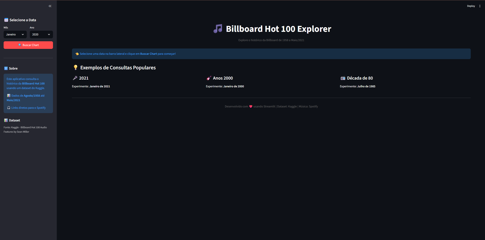
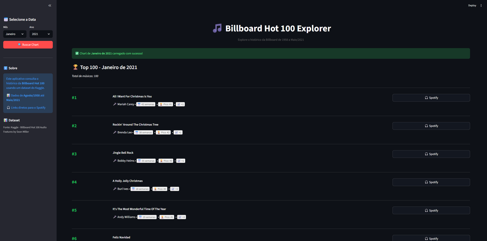

# 🎵 Billboard Hot 100 Explorer

Uma aplicação web interativa construída com Streamlit para explorar o histórico completo da Billboard Hot 100 de 1958 a 2021, com integração direta ao Spotify.


## 📋 Sobre o Projeto

Esta aplicação permite que você:
- 🔍 Consulte qualquer semana da Billboard Hot 100 entre Agosto/1958 e Maio/2021
- 📊 Visualize informações detalhadas de cada música (posição, semanas no chart, pico, etc.)
- 🎧 Acesse links diretos para busca no Spotify
- 📈 Acompanhe a evolução de posições semana a semana

## 🎯 Funcionalidades

- **Busca por Data**: Selecione mês e ano para ver o chart correspondente
- **Dados Completos**: Top 100 músicas com estatísticas detalhadas
- **Integração Spotify**: Links diretos para cada música
- **Interface Responsiva**: Design limpo e intuitivo
- **Performance Otimizada**: Cache de 24h para carregamento rápido

## 🛠️ Tecnologias Utilizadas

- **Python 3.11+**
- **Streamlit**: Framework para interface web
- **Pandas**: Manipulação e análise de dados
- **KaggleHub**: Download automático do dataset
- **BeautifulSoup4**: Parsing HTML (preparado para scraping futuro)

## 📦 Instalação

### Pré-requisitos

- Python 3.11 ou superior
- pip (gerenciador de pacotes Python)

### Passo a Passo

1. **Clone o repositório**
```bash
git clone https://github.com/SEU_USUARIO/billboard-app.git
cd billboard-app
```

2. **Crie um ambiente virtual (recomendado)**
```bash
python -m venv venv

# Windows
.\venv\Scripts\activate

# Linux/Mac
source venv/bin/activate
```

3. **Instale as dependências**
```bash
pip install -r requirements.txt
```

4. **Execute a aplicação**
```bash
streamlit run app.py
```

5. **Acesse no navegador**
```
http://localhost:8501
```

## 📊 Fonte de Dados

O projeto utiliza o dataset [Billboard Hot 100 Audio Features](https://www.kaggle.com/datasets/thedevastator/billboard-hot-100-audio-features) disponível no Kaggle, criado por Sean Miller.

**Período disponível**: Agosto de 1958 a Maio de 2021

O download do dataset é feito automaticamente na primeira execução através do KaggleHub.

## 🏗️ Arquitetura

O projeto segue o padrão **Service-UI**, separando lógica de negócio da interface:
```
billboard-app/
├── app.py                      # Interface Streamlit (UI Layer)
├── services/
│   ├── billboard_service.py    # Lógica de busca de charts
│   └── spotify_service.py      # Geração de links Spotify
├── utils/
│   └── helpers.py              # Funções auxiliares (validação, formatação)
└── requirements.txt            # Dependências do projeto
```

### Princípios de Design

- ✅ **Separação de Responsabilidades**: UI separada da lógica de negócio
- ✅ **Cache Inteligente**: Otimização com Streamlit cache (TTL 24h)
- ✅ **Código Limpo**: Seguindo PEP 8 e boas práticas Python
- ✅ **Tratamento de Erros**: Feedback claro para o usuário

## 🎨 Screenshots

### Tela Inicial


### Resultados do Chart


## 🚀 Melhorias Futuras

- [ ] Adicionar gráficos de evolução de músicas ao longo do tempo
- [ ] Implementar análise de características de áudio (danceability, energy, etc.)
- [ ] Criar sistema de favoritos
- [ ] Adicionar comparação entre diferentes períodos
- [ ] Exportar resultados em CSV/Excel
- [ ] Modo escuro (dark mode)

## 🤝 Contribuindo

Contribuições são bem-vindas! Sinta-se à vontade para:

1. Fazer um Fork do projeto
2. Criar uma branch para sua feature (`git checkout -b feature/NovaFuncionalidade`)
3. Commit suas mudanças (`git commit -m 'Adiciona nova funcionalidade'`)
4. Push para a branch (`git push origin feature/NovaFuncionalidade`)
5. Abrir um Pull Request

## 📝 Licença

Este projeto está sob a licença MIT. Veja o arquivo [LICENSE](LICENSE) para mais detalhes.

## 👤 Autor

**Seu Nome**
- GitHub: [@eagmarques](https://github.com/eagmarques)
- LinkedIn: [Eduardo Marques](https://linkedin.com/in/eagmarques)

## 🙏 Agradecimentos

- [Sean Miller](https://www.kaggle.com/thedevastator) pelo dataset do Kaggle
- Billboard pela fonte original dos dados

---

⭐ Se este projeto foi útil para você, considere dar uma estrela!
```

---

### 5.4 Criar arquivo `LICENSE`

Crie o arquivo `LICENSE`:
```
MIT License

Copyright (c) 2026 [Seu Nome]

Permission is hereby granted, free of charge, to any person obtaining a copy
of this software and associated documentation files (the "Software"), to deal
in the Software without restriction, including without limitation the rights
to use, copy, modify, merge, publish, distribute, sublicense, and/or sell
copies of the Software, and to permit persons to whom the Software is
furnished to do so, subject to the following conditions:

The above copyright notice and this permission notice shall be included in all
copies or substantial portions of the Software.

THE SOFTWARE IS PROVIDED "AS IS", WITHOUT WARRANTY OF ANY KIND, EXPRESS OR
IMPLIED, INCLUDING BUT NOT LIMITED TO THE WARRANTIES OF MERCHANTABILITY,
FITNESS FOR A PARTICULAR PURPOSE AND NONINFRINGEMENT. IN NO EVENT SHALL THE
AUTHORS OR COPYRIGHT HOLDERS BE LIABLE FOR ANY CLAIM, DAMAGES OR OTHER
LIABILITY, WHETHER IN AN ACTION OF CONTRACT, TORT OR OTHERWISE, ARISING FROM,
OUT OF OR IN CONNECTION WITH THE SOFTWARE OR THE USE OR OTHER DEALINGS IN THE
SOFTWARE.